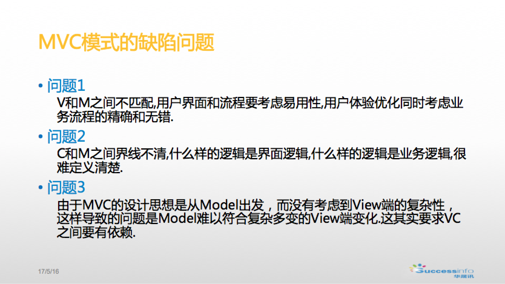
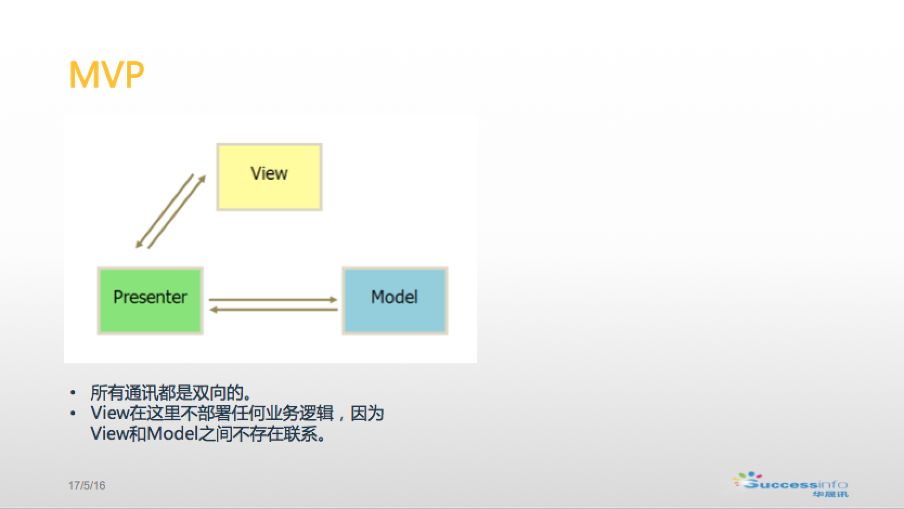
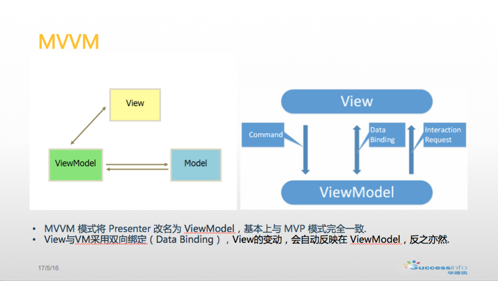
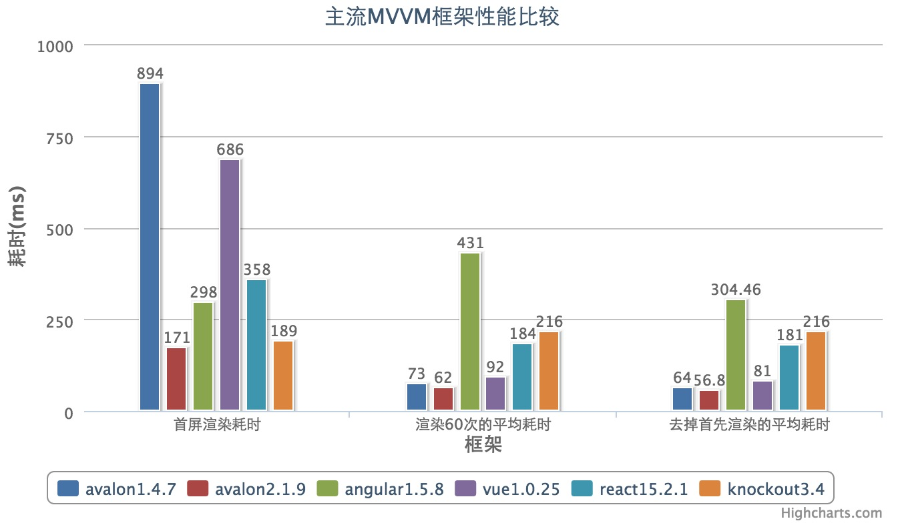
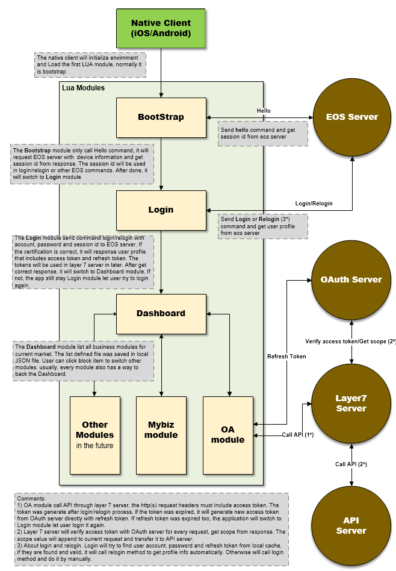
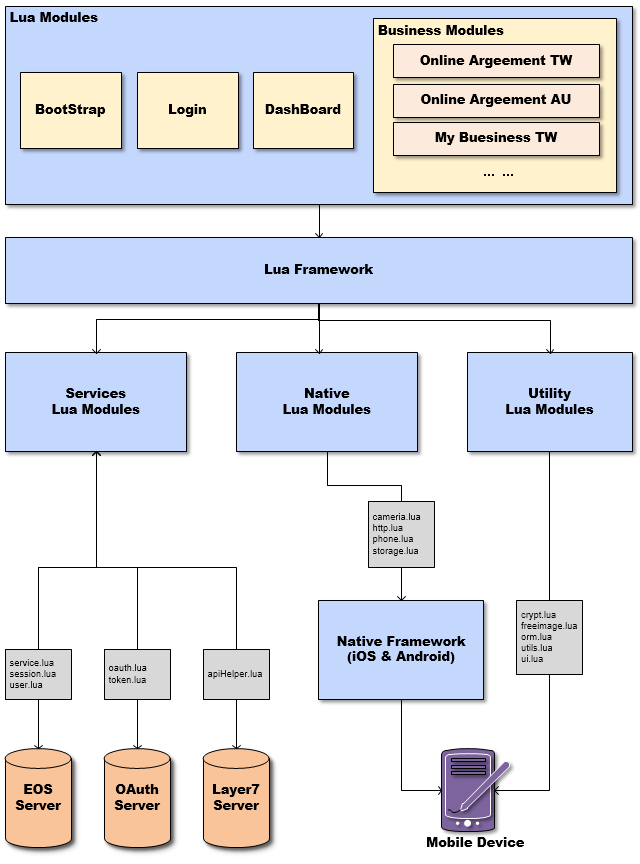

# Doc
`This is a text repository`

## 开发模式
* MVC defect

- MVP 

+ MVVM

* 主流MVVM框架性能对比

## React Native
[React Native 中文网](http://reactnative.cn/)

## My Native
+ Native work process

[native tab Doc](https://github.com/successinfo-org/cloudapp-wiki/blob/master/client/api/index.md)